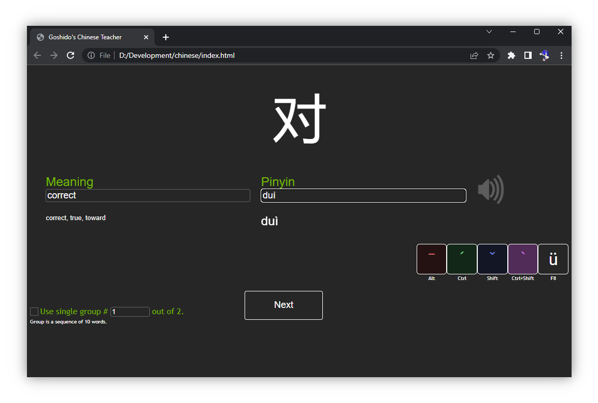

# Goshido's Chinese Teacher

Welcome to _Goshido's Chinese Teacher_ source code repository. This project was started as personal hobby. Main purpose of the project is learning [Mandarin Chinese](https://en.wikipedia.org/wiki/Mandarin_Chinese) pronunciation and simplified characters.

## Introduction

_Goshido's Chinese Teacher_ is a local web application. _Goshido's Chinese Teacher_ is dedicated to learning chinese characters and pronunciation.

## Quick start instructions

### Requirements

* _Google Chrome v.109.0.5414.75 (Official Build) (64-bit) +_
* _QWERTY_ keyboard with `en-us` layout

To begin, clone this repository onto your local drive.

Next step is to grag'n'drop `<repo>/index.html` page on browser window.

## How to extend

The dictionary database is located in single _JavaScript_ source file: `<repo>/js/database.js`.

The sound location is in `<repo>/res/cues` directory. Preferable format is:

- [_OGG/Vorbis_](https://en.wikipedia.org/wiki/Vorbis)
- 5/10 compression quality
